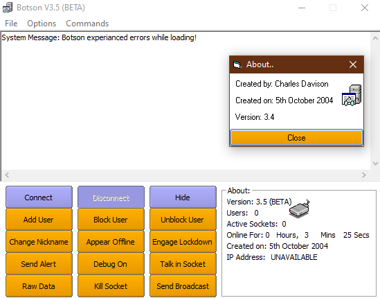

# Botson-2.0
A Facebook Messenger port of one of my earliest journeys into programming...an MSN Messenger bot written in VB6 (circa 2004).

Although almost every feature is largely useless as a Facebook bot (I do miss online guestbooks though, whatever happened to those?), this project is serving as a useful
tool to team myself more about AWS services like Lambda, Cloudformation, DynamoDB, Cloudwatch, IAM Roles, S3 and SSM (to name a few!).

## Original

The original version of Botson was an MSN Messenger chatbot. At the time I was discovering the power of WinForms and VB6, and with MSN Messenger being a huge part of my social life back then both with school friends and strangers I had wanted to build something that could bridge those two things I enjoyed.

MSN Bots were a bit of a niche phenomenon at that period. Bots like DestructiveChild (a play on SmarterChild, another AIM bot at the time) and Bot2k3 - written by Siebe Tolsma had amassed a following and I was keen to see if I could do something similar.  

The basis of the bot was some sample code from a project called `MSNP9 Bot`. I don't remember how I came across the example, but looking at the code comments it appears to have been written by Joe Hegarty. This provided the basics such as connecting to MSN using their P9 protocol, sending/receiving messages, and accepting friend requests. Everything else was done with the help of resources such as http://msn-messenger-protocol.herokuapp.com/ and trial and error.

At the time, I was running this just on my home PC, so it would be online only when I was online. I'm fairly sure this would have still been during the period before we got broadband internet access.

Over time, I added more and more functionality to the bot, mostly just little games, or things that involved picking a random line from a list of items in a file. It looks like I managed to squeeze quite a lot out of that functionality - introducing Random Fact, 8 Ball, Yo Momma Jokes commands, all based on that principle. 

The bot had a WinForms based UI that could be used to perform various admin tasks and showed activity on the bot such as conversations, new friend requests coming in etc.

